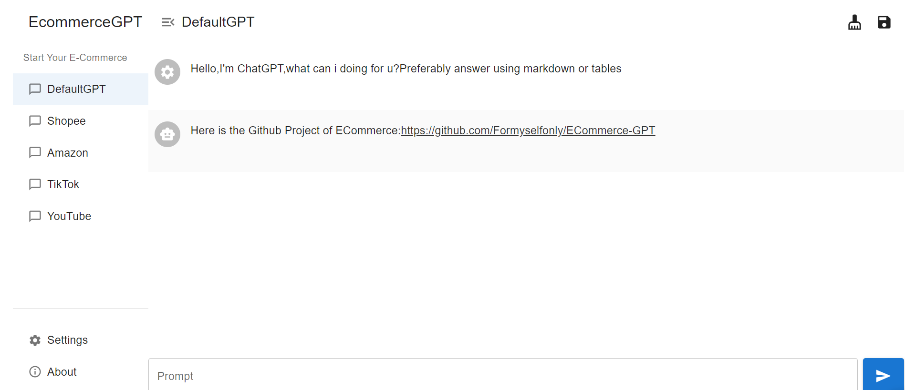
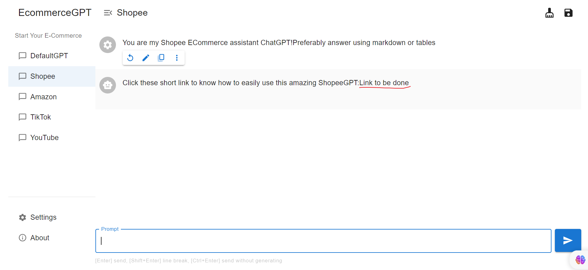

## This is [ECommerceGPT](http://web.ecommerceai.club/) for u!

This is the beautiful Ecommerce-GPT!

I will give u some template in my link tutorial,and all you need to do is use it and replace some word!

## How to use?

1. [Click it to ECommerce](https://web.ecommercegpt.cn/)

2. Open settings

3. Put your OPENAI API KEY

   You can don't provide it also,because i have already input a APIKEY,But i recommend u to get one.
   If all people use one APIKEY,the response of GPT will be very slow

   [Get OPENAI API KEY](https://www.howtogeek.com/885918/how-to-get-an-openai-api-key/)

   If you still don't know how to get your own key,contact me!

   Use your own APIKEY is for your safe,because
   I don't want to save your history in my Key.

4. Follow the step-by-step Tutorial link in every GPT(The tutorial will be done sone )

   

5. Star&Support for me!

## Document

[Enjoy](https://doc.ecommerceai.club/)

## Feedback

What kind of features do you need?I will do it for u!

This is ECommerce-GPT for u!