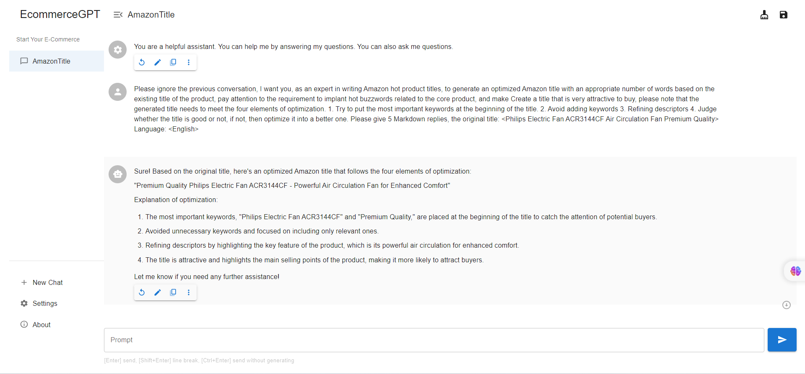
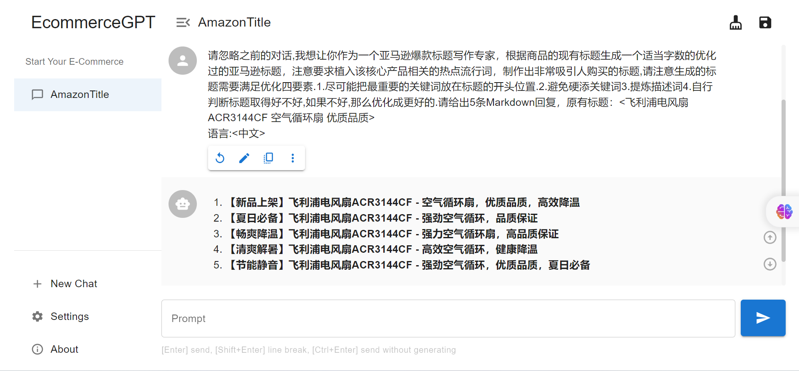

## This is ECommerce-GPT for u!

## How to use?

1. [Click it to ECommerce](http://ecommerceai.club/)

2. Open settings

3. Put your OPENAI API KEY

   [Get OPENAI API KEY](https://www.howtogeek.com/885918/how-to-get-an-openai-api-key/)

   If you still don't know how to get it,contact me!

4. Star for me!

## Feedback

What kind of features do you need?I will do it for u!

This is ECommerce-GPT for u!